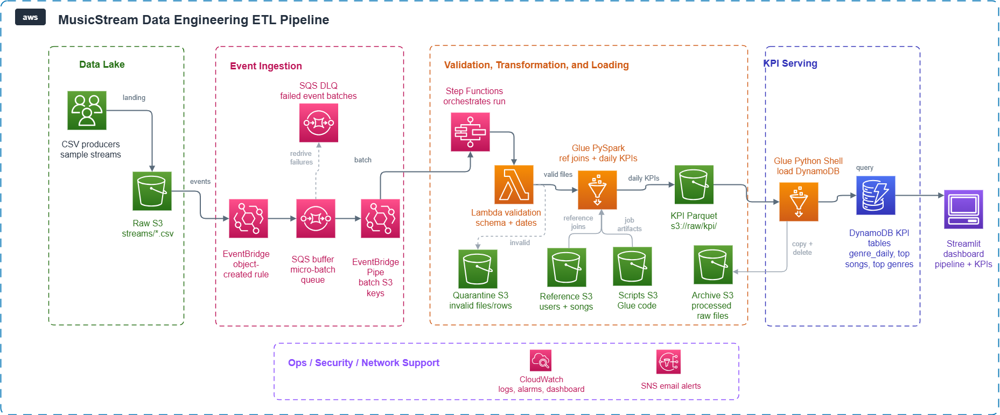

# MusicStream — Event-Driven Streaming Analytics ETL Pipeline

MusicStream is an event-driven, micro-batch ETL pipeline designed to ingest, validate, transform, and analyze user streaming behavior at scale. Built as a fully serverless architecture on AWS, the system automatically processes raw stream datasets as they arrive, computes daily genre-level metrics, and exposes aggregates to a low-latency business dashboard.

---

## Architecture



---

## Core Engineering & Design Decisions

Rather than executing standard periodic cron batches, the system implements a modern, event-driven architecture using several senior-level design decisions to balance cost, performance, and data quality:

### 1. Ingestion: Event-Driven Micro-Batching
* **The Design:** S3 Object Created events trigger an EventBridge rule that routes events to an SQS Buffer Queue. An EventBridge Pipe polls the SQS queue, batches records over a 120-second window (or up to 50 records), reshapes them via a lightweight Lambda enrichment function (`dev-pipe-enrichment`), and invokes the Step Functions workflow.
* **The Rationale:** Processing files individually would require spinning up a new Glue PySpark cluster for every S3 upload, which would be financially ruinous under high file frequency. Buffering events in SQS and micro-batching them ensures we only spin up Glue workers for cost-effective, bulk transformations.

### 2. Validation: Progressive 3-Tier Gate
To protect downstream database states and minimize compute expenses, we enforce a strict 3-tier progressive validation contract:
* **Tier 1 (Schema Validation - Lambda):** A lightweight Lambda function (`dev-validate-schema`) validates basic structural schema. It performs a **4 KB S3 Range Request** to read only the CSV header rather than downloading the entire file. This runs in milliseconds and prevents expensive Glue DPUs from spinning up for corrupted or improperly partitioned files.
* **Tier 2 (Referential Integrity - PySpark Left-Join):** Validates that all incoming `track_id` and `user_id` values exist in the songs and users reference datasets. Unmatched rows are partitioned out and written to the S3 Quarantine bucket (`ref-fail/`) with full run context, keeping data errors visible rather than silently dropping them.
* **Tier 3 (Domain Business Rules - PySpark):** Filters out anomalies and bots (e.g. streaming tracks longer than 30 minutes, or a single user streaming the same track more than 1,000 times a day).

### 3. Storage & Idempotency: Dynamic Partitioning & Upserts
* **The Design:** PySpark aggregates the clean records into 6 daily genre-level KPIs and writes them to S3 in Parquet format using Spark's **dynamic partition overwrite mode** (`spark.sql.sources.partitionOverwriteMode = dynamic`). The Glue Python Shell loader reads the Parquet outputs and writes them into three distinct DynamoDB KPI tables.
* **The Rationale:** 
  * Dynamic overwrite ensures that Spark only overwrites partitions for dates present in the current batch, leaving other historical dates untouched.
  * DynamoDB writes use deterministic primary keys (composed of date, genre, and rank) and write via `PutItem` (upsert). If the same raw stream is reprocessed, the pipeline overwrites the previous aggregates without duplicating data.
  * S3 files are moved to the S3 Archive bucket and deleted from raw post-execution, preventing infinite re-triggering loops.

### 4. Database Modeling: Multi-Table over Single-Table
* **The Design:** Three dedicated, purpose-built DynamoDB tables: `genre_daily_kpi`, `top_songs_daily`, and `top_genres_daily`.
* **The Rationale:** While Single-Table Design is standard in transactional systems, it adds unnecessary complexity for analytical querying. Because our dashboard queries these three analytical KPIs independently, dedicated tables allow us to size, provision, and monitor read/write capacities separately.

### 5. Security & Decoupling: Root-Principal Key Delegation
* **The Design:** KMS Key Policies delegate admin/use permissions entirely to the AWS Account Root Principal, allowing role permissions to be managed natively via IAM policies.
* **The Rationale:** Decoupling KMS policies from specific role ARNs breaks the classic Terraform circular dependency (Role needs KMS Key; KMS Key Policy needs Role ARN) and permits clean, modular deployments.

---

## Technology Stack

| Layer | Technology | Operational Rationale |
|-------|------------|-----------------------|
| **Storage** | Amazon S3 | Serverless, encrypted data lake partitioned by Hive conventions. |
| **Compute (Transform)** | AWS Glue PySpark 4.0 | Distributed joins and aggregations using a 2-worker G.1X cluster. |
| **Compute (Load)** | AWS Glue Python Shell | Cost-efficient loading (0.0625 DPU) optimized for sequential I/O writes. |
| **Validation Gate** | AWS Lambda Python 3.12 | Microsecond executions; performs 4 KB S3 range requests to check headers. |
| **Orchestration** | AWS Step Functions | Standard state machine managing error branching, retries, and state transitions. |
| **Eventing & Buffering** | EventBridge + Amazon SQS | Loose coupling, batching, and reliable event delivery. |
| **Database** | Amazon DynamoDB | Fully managed, low-latency NoSQL database configured for PAY_PER_REQUEST. |
| **Security** | AWS KMS | Customer Managed Keys (CMKs) enforcing envelope encryption at rest. |
| **IaC** | Terraform ≥ 1.6 | 11 reusable infrastructure modules managing bootstrap remote states and environments. |
| **UI Dashboard** | Streamlit + Boto3 | Deployed as an internal tool; reads directly from DynamoDB using local AWS profiles. |

---

## Repository Structure

```
.
├── .ai/                     # Portfolio docs: architecture decisions, testing guide, interview Q&A
├── docs/                    # Architectural planning, schemas, and design constraints
├── infra/
│   ├── bootstrap/           # Remote state S3 bucket and DynamoDB lock table module
│   ├── envs/dev/            # Dev environment environment configuration
│   └── modules/             # 11 reusable infrastructure modules (KMS, S3, IAM, SQS, Glue, Lambda, etc.)
├── glue/
│   ├── pyspark/             # transform_kpis.py — PySpark left-join + 6 KPI aggregates
│   ├── python_shell/        # load_dynamodb.py — reads Parquet, writes to DynamoDB
│   └── shared/              # Shared wheel: logging, database utils, S3 helpers, schemas
├── lambda/
│   └── validate_schema/     # T1 Schema Gate Lambda handler
├── step_functions/
│   └── pipeline.asl.json    # Step Functions Amazon States Language (ASL) definition
├── ui/
│   ├── app.py               # Streamlit application entry point
│   ├── pages/               # Multi-page dashboard pages
│   └── lib/                 # DynamoDB queries, mock client fixtures, AWS clients
├── tests/
│   ├── unit/                # Offline unit tests (Lambda schema validation, utility functions)
│   └── integration/         # Active AWS connectivity tests
└── musicstream_architecture.png  # Architecture visual diagram
```

---

## CI/CD and Automation

The repository includes fully automated pipelines managed via GitHub Actions:

1. **Continuous Integration (`ci.yml`):**
   * Triggered on every Pull Request and commit to `main` and `dev`.
   * Enforces code formatting checks using `ruff` and `black`.
   * Executes offline unit tests using `pytest`.
   * Validates Terraform HCL syntax (`terraform validate` and `tflint`).
   * Runs static security audits on infrastructure modules (`checkov`) and application code (`semgrep`).

2. **Continuous Deployment (`cd-dev.yml`):**
   * Automatically packages Lambda functions, builds the shared Python wheel, syncs scripts to S3, and applies Terraform infrastructure changes to the `dev` environment on merges to `main`.

3. **Continuous Deployment (`cd-prod.yml`):**
   * Triggered on semver tags. Generates a dry-run Terraform plan for the production environment and holds execution behind a GitHub environment manual approval gate.
