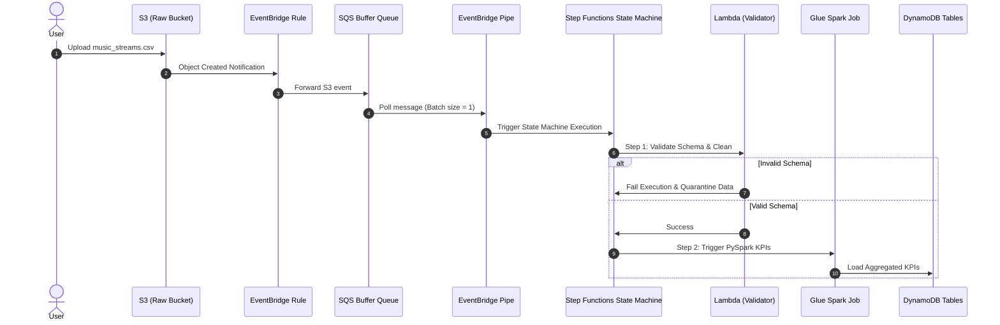

# AWS Console Navigation & Monitoring Guide

This guide details how to navigate the AWS Console to monitor, inspect, and trace data flowing through the **MusicStream ETL Pipeline** from end to end.

---

## 1. Overall Data Flow (What happens when data comes?)

When you upload or seed data, the pipeline executes in real-time. Here is the path the data takes:



---

## 2. Navigating the AWS Console

### 📥 S3 Buckets (Storage & Raw Landing)
Search for **S3** in the AWS console. Locate these buckets:

1. **`musicstream-dev-raw-970547336735`**
   * **What to view:** This is where the incoming client CSV files land.
   * **When data comes:** Drag and drop or run `make seed-data`. As soon as a file is uploaded, the SQS trigger starts.
2. **`musicstream-dev-archive-970547336735`**
   * **What to view:** Holds successfully processed raw CSV files (backed up here automatically by the pipeline).
3. **`musicstream-dev-quarantine-970547336735`**
   * **What to view:** If a raw CSV file fails validation (e.g., missing columns or corrupt schema), the `validate_schema` Lambda moves the file here for manual inspection.
4. **`musicstream-dev-reference-970547336735`**
   * **What to view:** Contains folders for `/users/` and `/songs/` containing reference CSVs, and the output `/users_parquet/` and `/songs_parquet/` after Parquet conversion.
5. **`musicstream-dev-scripts-970547336735`**
   * **What to view:** Houses the uploaded code assets (Glue Python/PySpark scripts, Lambda deployment ZIPs).

---

### 📬 SQS Queue (Message Buffering)
Search for **Simple Queue Service (SQS)**. Locate:
* **Name:** `dev-etl-buffer`
* **URL:** `https://sqs.eu-west-1.amazonaws.com/970547336735/dev-etl-buffer`

**How to Monitor:**
1. Click on **`dev-etl-buffer`**.
2. **Messages Available (Queue Depth):** When a file is uploaded to the raw S3 bucket, S3 sends an event to this queue. You'll briefly see `Messages Available` go up to `1`.
3. **Trigger Action:** The EventBridge Pipe constantly polls this queue. Almost instantly, the pipe consumes the message, so the queue depth should return to `0`.
4. **Dead-Letter Queue (DLQ):** If the pipeline fails repeatedly to process the event, it goes to `dev-etl-buffer-dlq`. Check this if messages are stuck.

---

### 🔗 EventBridge Pipe (Integration)
Search for **Amazon EventBridge** -> click **Pipes** on the left menu.
* **Name:** `dev-sqs-to-sfn-pipe`

**How to Monitor:**
1. This pipe connects SQS directly to Step Functions.
2. Under the **Monitoring** tab, you can view the execution metrics: *Pipe executions started*, *Pipe execution errors*, and *Target execution duration*.

---

### ⚙️ Step Functions (State Machine Orchestrator)
Search for **Step Functions** -> click **State Machines**.
* **Name:** `dev-streaming-etl-sm`
* **ARN:** `arn:aws:states:eu-west-1:970547336735:stateMachine:dev-streaming-etl-sm`

**This is the best place to demo visual execution:**
1. Click on `dev-streaming-etl-sm`.
2. Under **Executions**, you will see a list of past runs (showing statuses like *Succeeded*, *Running*, or *Failed*).
3. Click on any execution ID to view the **Graph view**.
   * It shows the interactive visual workflow.
   * Green steps were successful, blue is running, red failed.
   * Click on the `ValidateSchema` step to view input/output JSON arguments and logs.

---

### ⚡ Lambda Functions (Custom Logic & Processing)
Search for **Lambda** -> click **Functions**.

#### 1. `dev-validate-schema` (Validation Gate)
* **Purpose:** Acts as a schema gatekeeper before any Spark job runs.
* **What it does:**
  1. Reads only the first **4 KB** of a newly uploaded S3 CSV object (saves network and computation costs by not downloading the whole file). If headers are extremely wide, it falls back to 64 KB.
  2. Parses the CSV header to confirm required columns (`user_id`, `track_id`, `listen_time`) are present, and checks for duplicates.
  3. Validates that there is at least one row of data and parses the first row's `listen_time` to confirm it is a valid datetime.
  4. Confirms that the S3 key's partition matches the internal event timestamp date.
  5. If the file is **valid**, it is passed forward. If **invalid**, it automatically copies the CSV file to the Quarantine S3 bucket and publishes a `_reason.json` sidecar detailing the exact failure.
* **Monitoring:** Under the **Monitor** tab, click **View CloudWatch logs** to trace validation print outputs.

#### 2. `dev-pipe-enrichment` (Payload Reshaper)
* **Purpose:** Acts as a payload translator between SQS and the Step Functions orchestrator.
* **What it does:**
  1. Triggered by EventBridge Pipes whenever a batch of SQS messages is processed.
  2. SQS events deliver raw event metadata. This Lambda extracts the S3 bucket name and key path for all files in the batch.
  3. Reshapes the input payload into a single, unified JSON structure expected by the Step Functions `ParseInput` task:
     ```json
     {
       "detail": {
         "bucket": { "name": "<bucket_name>" },
         "object": { "keys": ["<key_1>", "<key_2>"] }
       }
     }
     ```
* **Monitoring:** Under the **Monitor** tab, review *Invocations* and *Error counts*.

---

### 💧 AWS Glue (PySpark Analytics & Parquet Refresh)
Search for **AWS Glue** -> click **ETL jobs** under *Data Integration and APIs*.
There are three jobs:
1. **`dev-refresh-reference`** (Python Shell): Triggered when reference CSVs are uploaded. Converts them to Parquet format.
2. **`dev-transform-kpis`** (PySpark): Processes stream analytics and writes consolidated reports.
3. **`dev-load-dynamodb`** (Python Shell): Populates KPI aggregations into DynamoDB tables.

**How to Monitor:**
1. Click on any job name.
2. Under **Runs**, look at the run history, execution status, elapsed time, and standard error logs.

---

### 📊 DynamoDB (Target Datastores)
Search for **DynamoDB** -> click **Tables** -> click **Explore items** on the left menu.
Locate these three tables:
1. **`dev_genre_daily_kpi`**
2. **`dev_top_genres_daily`**
3. **`dev_top_songs_daily`**

**When data comes:**
1. Click on a table name, then click **Explore table items**.
2. Click **Run search** (scan).
3. Once the Glue ETL finishes, these tables will populate with structured streaming analytics (e.g., song plays, daily active users, top listening genres).

---

## 4. Demo Walkthrough Strategy (Interactive Monitoring)

To show a supervisor the pipeline *in action*, open these three browser tabs:

1. **Tab 1: S3 console** (inside the Raw Bucket).
2. **Tab 2: Step Functions console** (viewing the executions of `dev-streaming-etl-sm`).
3. **Tab 3: DynamoDB console** (exploring items in `dev_top_songs_daily`).

**The Demo Action:**
* Run `make seed-data` in your terminal.
* Instantly switch to **Tab 2 (Step Functions)** and hit refresh. A new execution will pop up as *Running*.
* Click on it to show the green highlight moving from validation to the Glue job step.
* Once the state machine completes, go to **Tab 3 (DynamoDB)**, run a search, and show them the populated analytics tables!
